# PyOS 操作系统教程

## 前言

欢迎来到 PyOS 操作系统教程！本教程将通过一个用 Python 实现的操作系统模拟器，带你深入理解操作系统的核心概念和实现原理。

### 教程特点

- **理论与实践结合**：每个概念都配有可运行的代码示例
- **循序渐进**：从简单到复杂，逐步深入
- **动手实践**：提供大量练习和思考题
- **中文注释**：代码注释详尽，便于理解

### 学习建议

1. 按章节顺序学习，每个章节都有前置知识要求
2. 阅读代码时，先看注释理解整体逻辑，再深入细节
3. 运行示例代码，观察输出结果
4. 尝试修改代码，观察行为变化
5. 完成每章的练习题

---

## 目录

- [第一章：操作系统概述](#第一章操作系统概述)
- [第二章：进程管理](#第二章进程管理)
- [第三章：进程调度](#第三章进程调度)
- [第四章：内存管理](#第四章内存管理)
- [第五章：虚拟内存](#第五章虚拟内存)
- [第六章：文件系统](#第六章文件系统)
- [第七章：设备管理](#第七章设备管理)
- [第八章：中断与系统调用](#第八章中断与系统调用)
- [第九章：进程同步](#第九章进程同步)
- [第十章：死锁](#第十章死锁)
- [第十一章：线程管理](#第十一章线程管理)
- [第十二章：I/O系统](#第十二章io系统)
- [第十三章：进程间通信](#第十三章进程间通信)
- [附录A：快速入门指南](#附录a快速入门指南)
- [附录B：实验指导](#附录b实验指导)

---

## 第一章：操作系统概述

### 1.1 什么是操作系统

操作系统（Operating System, OS）是计算机系统中最基本的系统软件，它管理和控制计算机硬件与软件资源，为用户和其他软件提供接口和服务。

#### 1.1.1 操作系统的角色

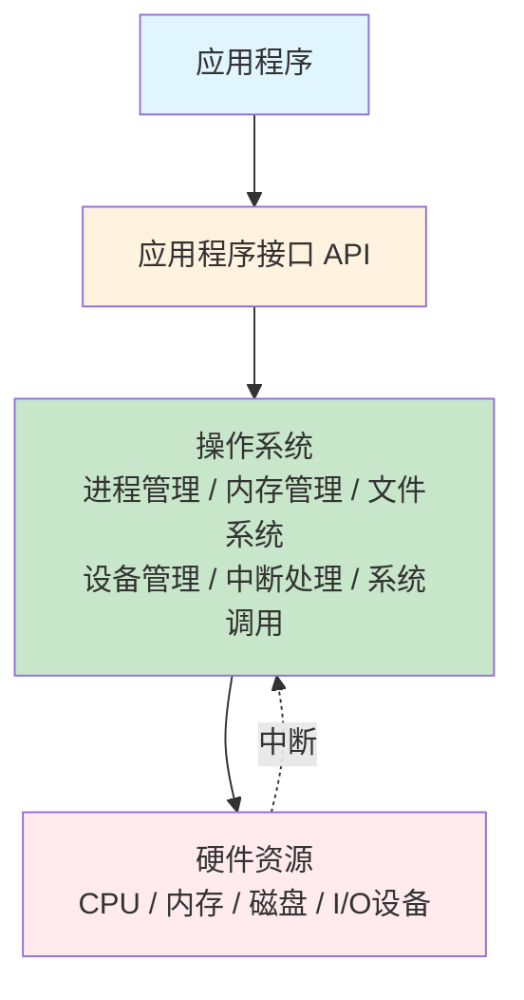

**操作系统的三大角色**：
1. **资源管理者**：管理CPU、内存、I/O设备等硬件资源
2. **服务提供者**：为应用程序提供服务接口
3. **用户接口**：提供人机交互界面

#### 1.1.2 操作系统的发展历程

| 时期 | 类型 | 特点 |
|------|------|------|
| 1940s | 手工操作 | 无操作系统，人工控制 |
| 1950s | 批处理系统 | 自动作业切换，提高效率 |
| 1960s | 分时系统 | 多用户交互，时间片轮转 |
| 1970s | 实时系统 | 及时响应，可靠性高 |
| 1980s- | 现代操作系统 | 多任务、多用户、网络化 |

### 1.2 PyOS 项目架构

PyOS 是一个用 Python 实现的教学操作系统，模拟了真实操作系统的核心功能。

#### 1.2.1 系统架构图

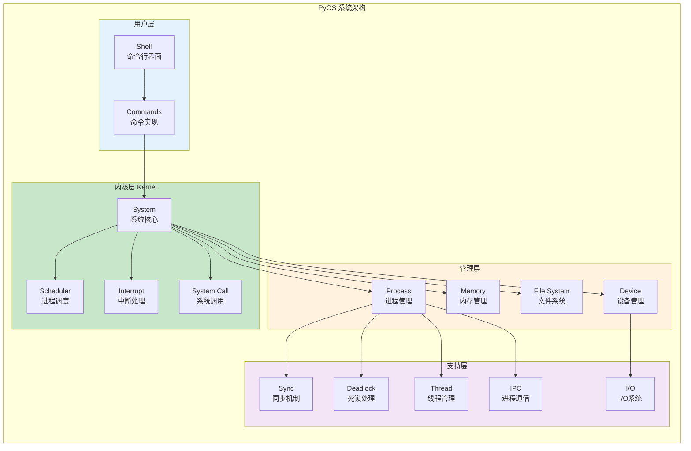

```
PyOS/
├── kernel/           # 内核模块 - 系统核心
│   ├── system.py     # 系统核心类
│   ├── scheduler.py  # 进程调度器
│   ├── interrupt.py  # 中断处理
│   └── system_call.py # 系统调用
├── process/          # 进程管理 - 进程的创建与调度
│   ├── process.py    # 进程类
│   ├── pcb.py        # 进程控制块
│   └── process_manager.py
├── memory/           # 内存管理 - 内存分配与虚拟内存
│   ├── virtual_memory.py
│   ├── memory_allocator.py
│   └── page_replacement.py
├── filesystem/       # 文件系统 - 文件与目录管理
│   ├── file_system.py
│   ├── inode.py
│   └── vfs.py
├── device/           # 设备管理 - 硬件设备抽象
│   └── device_manager.py
├── sync/             # 同步机制 - 进程同步原语
│   ├── semaphore.py
│   ├── mutex.py
│   └── condition.py
├── deadlock/         # 死锁处理 - 死锁检测与避免
│   ├── banker.py
│   └── detector.py
├── thread/           # 线程管理 - 线程与线程池
│   └── thread_pool.py
├── io/               # I/O系统 - I/O调度与缓冲
│   └── scheduler.py
├── ipc/              # 进程间通信 - 管道、共享内存
│   └── __init__.py
├── shell/            # 命令行界面 - 用户交互
│   ├── shell.py
│   └── commands.py
└── main.py           # 程序入口
```

#### 1.2.2 启动流程

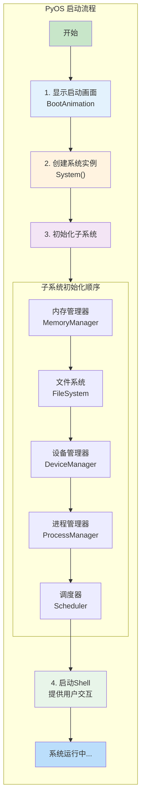

让我们从 `main.py` 开始，了解系统是如何启动的：

```python
# main.py
def main():
    """主程序入口"""
    logger = Logger()
    boot_anim = BootAnimation()

    try:
        # 1. 显示启动画面
        boot_anim.show_boot_screen()
        show_startup_sequence(boot_anim)
        
        # 2. 创建系统实例
        system = System()
        
        # 3. 启动系统
        system.boot()

        # 4. 启动Shell
        from shell.shell import Shell
        shell = Shell(system)
        shell.run()

    except KeyboardInterrupt:
        print("系统被用户中断")
    finally:
        print("感谢使用PyOS！")
```

**启动流程解析**：
1. **初始化日志系统**：记录系统运行信息
2. **显示启动画面**：模拟BIOS自检过程
3. **创建系统实例**：初始化各个子系统
4. **启动系统**：加载所有模块
5. **启动Shell**：提供用户交互界面

### 1.3 系统核心类

系统核心类 `System` 是整个操作系统的控制中心，负责协调各个子系统。

**代码位置**：`kernel/system.py`

```python
class System:
    """操作系统核心类
    
    该类负责协调调度器、内存管理、文件系统等各个子系统
    """
    
    def __init__(self):
        # 初始化系统组件
        self.scheduler = Scheduler()        # 进程调度器
        self.memory_manager = MemoryManager() # 内存管理器
        self.interrupt_handler = InterruptHandler() # 中断处理器
        self.system_call = SystemCall()     # 系统调用
        self.process_manager = ProcessManager() # 进程管理器
        self.file_system = FileSystem()     # 文件系统
        self.device_manager = DeviceManager() # 设备管理器
```

#### 1.3.1 子系统初始化顺序

系统启动时，各子系统按特定顺序初始化：

```python
def _init_subsystems(self):
    """初始化子系统"""
    # 1. 初始化内存管理（其他子系统需要内存）
    self.memory_manager.initialize()
    
    # 2. 初始化文件系统
    self.file_system.initialize()
    
    # 3. 初始化设备管理
    self.device_manager.initialize()
    
    # 4. 初始化进程管理（需要调度器和内存管理器）
    self.process_manager.initialize(self.scheduler, self.memory_manager)
    
    # 5. 启动调度器
    self.scheduler.start()
```

**思考题**：为什么内存管理器要最先初始化？

### 1.4 实践练习

#### 练习1.1：运行系统

```bash
# 安装依赖
pip install -r requirements.txt

# 运行系统
python main.py
```

预期输出：
```
==================================================
    Python简单操作系统 (PyOS)
    版本: 1.0.0
==================================================
系统启动成功！
欢迎使用PyOS Shell!
输入 'help' 查看可用命令
PyOS:/>
```

#### 练习1.2：探索Shell

在Shell中尝试以下命令：
```
PyOS:/> help          # 查看帮助
PyOS:/> info          # 查看系统信息
PyOS:/> ps            # 查看进程
PyOS:/> ls            # 列出文件
PyOS:/> version       # 查看版本
```

---

## 第二章：进程管理

### 2.1 进程的概念

进程（Process）是程序的一次执行过程，是操作系统资源分配的基本单位。

#### 2.1.1 进程与程序的区别

| 特性 | 程序 | 进程 |
|------|------|------|
| 本质 | 静态的代码集合 | 动态的执行过程 |
| 生命周期 | 永久存在 | 暂时的 |
| 组成 | 代码+数据 | 代码+数据+PCB |
| 资源 | 不占用系统资源 | 占用CPU、内存等 |

#### 2.1.2 进程的状态

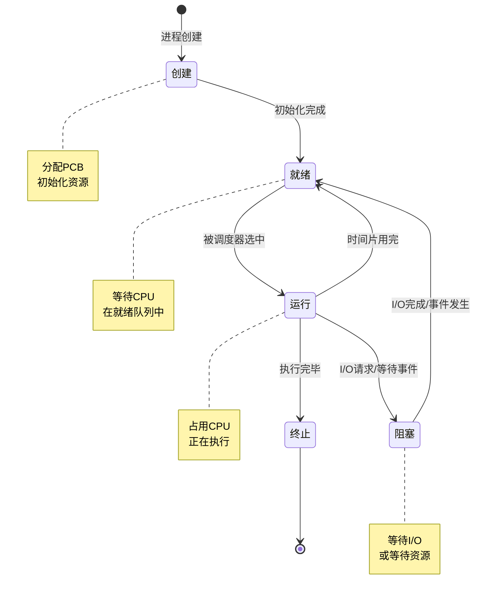

**五种基本状态**：
- **创建（New）**：进程正在被创建
- **就绪（Ready）**：进程已准备好运行，等待CPU
- **运行（Running）**：进程正在执行
- **阻塞（Waiting/Blocked）**：进程等待某个事件
- **终止（Terminated）**：进程执行完毕

**五种基本状态**：
- **创建（New）**：进程正在被创建
- **就绪（Ready）**：进程已准备好运行，等待CPU
- **运行（Running）**：进程正在执行
- **阻塞（Waiting/Blocked）**：进程等待某个事件
- **终止（Terminated）**：进程执行完毕

### 2.2 进程控制块（PCB）

进程控制块（Process Control Block, PCB）是操作系统用于描述和管理进程的数据结构。

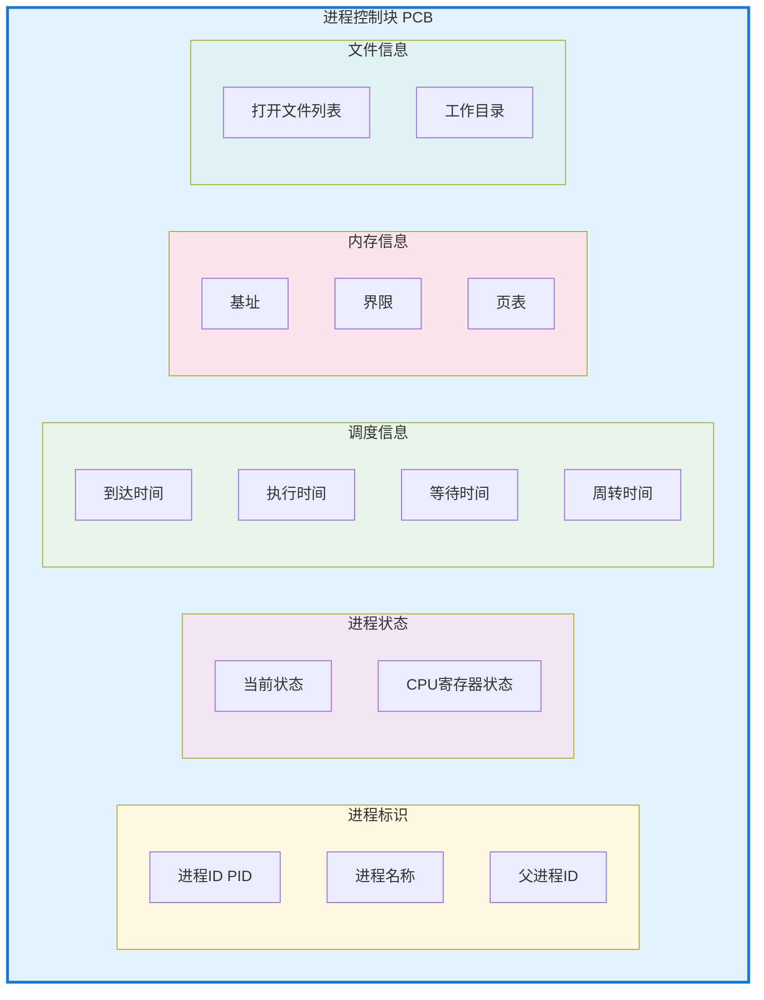

**代码位置**：`process/pcb.py`

```python
class PCB:
    """进程控制块
    
    PCB是进程存在的唯一标识，包含进程的所有控制信息
    """
    
    def __init__(self, pid: int, name: str, priority: int = 0):
        # 进程标识信息
        self.pid = pid              # 进程ID（唯一标识）
        self.name = name            # 进程名称
        self.priority = priority    # 优先级
        
        # 进程状态信息
        self.state = "new"          # 当前状态
        self.cpu_state = {}         # CPU寄存器状态
        
        # 进程调度信息
        self.scheduling_info = {
            'arrival_time': time.time(),  # 到达时间
            'burst_time': 0,              # 执行时间
            'waiting_time': 0,            # 等待时间
            'turnaround_time': 0          # 周转时间
        }
        
        # 内存管理信息
        self.memory_info = {
            'base_address': 0,      # 内存基址
            'limit': 0,             # 内存界限
            'page_table': {},       # 页表
            'memory_usage': 0       # 内存使用量
        }
        
        # 文件管理信息
        self.file_info = {
            'open_files': [],       # 打开的文件列表
            'working_directory': '/' # 工作目录
        }
        
        # 进程关系
        self.parent_pid = None      # 父进程ID
        self.child_pids = []        # 子进程ID列表
```

#### 2.2.1 PCB的作用

1. **进程标识**：唯一标识系统中的每个进程
2. **状态跟踪**：记录进程的当前状态和状态变化
3. **资源管理**：记录进程占用的资源
4. **调度依据**：为进程调度提供信息
5. **上下文切换**：保存和恢复进程的执行环境

### 2.3 进程类

**代码位置**：`process/process.py`

```python
class Process:
    """进程类
    
    表示操作系统中的一个进程，封装了进程的所有属性和行为
    """
    
    # 类变量：维护下一个可用的PID
    _next_pid = 1
    
    def __init__(self, name: str, priority: int = 0, target=None):
        # 分配唯一的PID
        self.pid = Process._next_pid
        Process._next_pid += 1
        
        self.name = name
        self.priority = priority
        self.target = target          # 进程执行的目标函数
        self.state = ProcessState.NEW
        
        # 创建进程控制块
        self.pcb = PCB(self.pid, self.name, self.priority)
        
        # 进程资源
        self.memory_usage = 0
        self.cpu_time = 0.0
        self.start_time = None
        self.end_time = None
        
        # 进程数据
        self.data = {}
        self.return_value = None
```

#### 2.3.1 进程状态转换

```python
def execute(self, time_quantum: float):
    """执行进程
    
    模拟进程执行一个时间片
    """
    if self.state != ProcessState.RUNNING:
        return

    if self.start_time is None:
        self.start_time = time.time()

    if self.target:
        # 执行目标函数
        self.return_value = self.target()
        self.state = ProcessState.TERMINATED
    else:
        # 模拟CPU密集型任务
        time.sleep(min(time_quantum, 0.1))
        self.cpu_time += time_quantum

        # 检查是否完成
        if self.cpu_time >= 5.0:
            self.state = ProcessState.TERMINATED

def suspend(self):
    """挂起进程：运行 -> 阻塞"""
    if self.state == ProcessState.RUNNING:
        self.state = ProcessState.WAITING

def resume(self):
    """恢复进程：阻塞 -> 就绪"""
    if self.state == ProcessState.WAITING:
        self.state = ProcessState.READY

def terminate(self):
    """终止进程：任意状态 -> 终止"""
    self.state = ProcessState.TERMINATED
    self.end_time = time.time()
```

### 2.4 进程管理器

进程管理器负责进程的创建、调度、终止等操作。

**代码位置**：`process/process_manager.py`

```python
class ProcessManager:
    """进程管理器
    
    负责进程的创建、销毁和管理
    """
    
    def create_process(self, name: str, priority: int = 0, 
                       target=None) -> Process:
        """创建新进程
        
        1. 创建进程对象
        2. 添加到进程表
        3. 分配内存
        4. 添加到调度器
        """
        # 1. 创建进程
        process = Process(name, priority, target)
        
        # 2. 添加到进程表
        self.process_table.add_process(process)
        
        # 3. 分配内存
        if self.memory_manager:
            memory_size = 1024  # 默认1KB
            allocated = self.memory_manager.allocate_memory(
                process.pid, memory_size
            )
            if allocated:
                process.memory_usage = memory_size
        
        # 4. 添加到调度器
        if self.scheduler:
            self.scheduler.add_process(process)
        
        return process
    
    def terminate_process(self, pid: int) -> bool:
        """终止进程
        
        1. 终止进程执行
        2. 从调度器移除
        3. 释放内存
        4. 从进程表移除
        """
        process = self.process_table.get_process(pid)
        if not process:
            return False
        
        # 1. 终止进程
        process.terminate()
        
        # 2. 从调度器移除
        if self.scheduler:
            self.scheduler.remove_process(pid)
        
        # 3. 释放内存
        if self.memory_manager:
            self.memory_manager.free_memory(pid)
        
        # 4. 从进程表移除
        self.process_table.remove_process(pid)
        
        return True
```

### 2.5 实践练习

#### 练习2.1：创建进程

```python
from kernel.system import System

# 创建系统实例
system = System()
system.boot()

# 定义一个任务函数
def my_task():
    print("进程正在执行...")
    for i in range(5):
        print(f"计数: {i}")
    return "任务完成"

# 创建进程
process = system.process_manager.create_process(
    name="my_process",
    priority=1,
    target=my_task
)

print(f"创建进程: {process}")
print(f"进程信息: {process.get_info()}")
```

#### 练习2.2：进程状态转换

编写代码观察进程状态的变化：

```python
# 创建进程后状态为 NEW
process = system.process_manager.create_process("test")
print(f"初始状态: {process.state}")  # NEW

# 启动进程后状态变为 READY
system.process_manager.start_process(process.pid)
print(f"启动后状态: {process.state}")  # RUNNING 或 READY

# 挂起进程
process.suspend()
print(f"挂起后状态: {process.state}")  # WAITING

# 恢复进程
process.resume()
print(f"恢复后状态: {process.state}")  # READY
```

#### 思考题

1. 为什么需要进程控制块（PCB）？它存储了哪些信息？
2. 进程和线程有什么区别？
3. 进程状态转换图中，哪些转换需要操作系统干预？

---

## 第三章：进程调度

### 3.1 调度的基本概念

进程调度是操作系统核心功能之一，决定哪个进程获得CPU的使用权。

#### 3.1.1 调度的层次

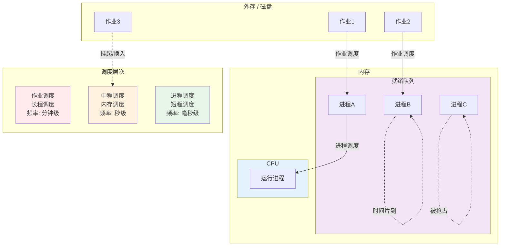

#### 3.1.2 调度的目标

1. **公平性**：每个进程都有机会获得CPU
2. **效率**：CPU利用率最大化
3. **响应时间**：交互式系统的快速响应
4. **吞吐量**：单位时间内完成的进程数
5. **周转时间**：从提交到完成的时间

### 3.2 调度算法

**代码位置**：`kernel/scheduler.py`

#### 3.2.1 时间片轮转（Round Robin）

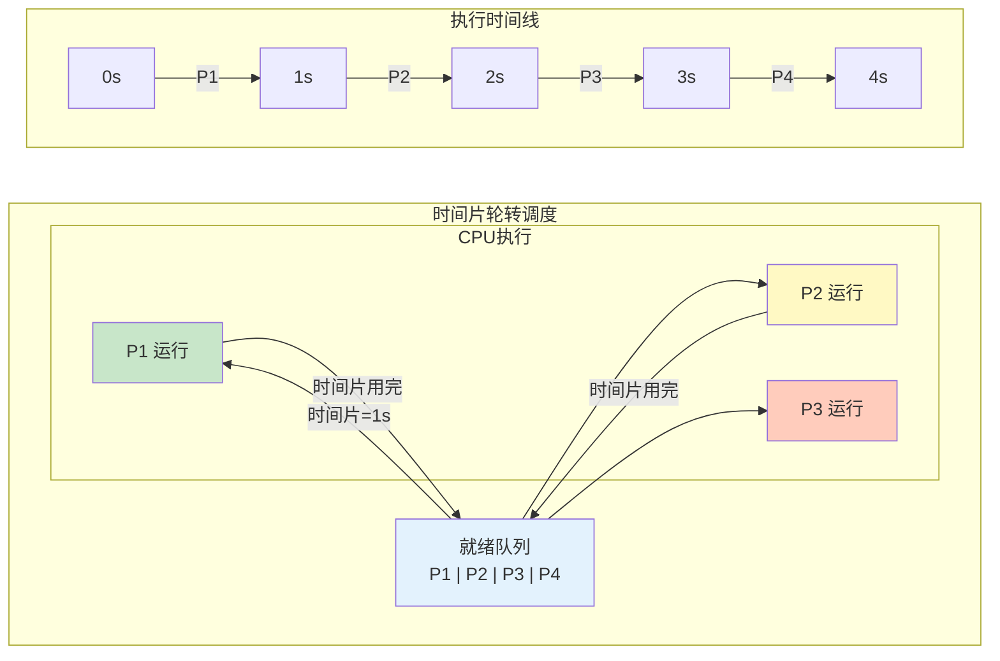

PyOS 默认采用时间片轮转算法：

```python
class Scheduler:
    """进程调度器
    
    采用时间片轮转算法，每个进程按顺序获得固定长度的CPU时间片
    """
    
    def __init__(self):
        self.ready_queue = queue.Queue()  # 就绪队列
        self.waiting_queue = queue.Queue() # 等待队列
        self.current_process = None        # 当前运行的进程
        self.time_quantum = 1.0           # 时间片（秒）
        
    def _scheduler_loop(self):
        """调度器主循环"""
        while self.running:
            if not self.ready_queue.empty():
                # 获取下一个进程
                process = self.ready_queue.get()
                self._execute_process(process)
            else:
                # 没有就绪进程，CPU空闲
                time.sleep(0.1)
    
    def _execute_process(self, process: Process):
        """执行进程一个时间片"""
        self.current_process = process
        process.state = ProcessState.RUNNING
        
        # 执行进程
        process.execute(self.time_quantum)
        
        # 如果进程未完成，重新加入就绪队列
        if process.state != ProcessState.TERMINATED:
            process.state = ProcessState.READY
            self.ready_queue.put(process)
```

**时间片轮转的特点**：
- **优点**：公平，响应时间好，适合分时系统
- **缺点**：上下文切换开销，时间片大小影响性能

#### 3.2.2 时间片大小的选择

| 时间片大小 | 优点 | 缺点 |
|------------|------|------|
| 太小 | 响应快 | 切换开销大 |
| 太大 | 吞吐量高 | 响应慢 |
| 适中 | 平衡 | 需要根据系统调整 |

**经验法则**：时间片应略大于一次典型交互所需时间

### 3.3 调度算法比较

#### 3.3.1 常见调度算法

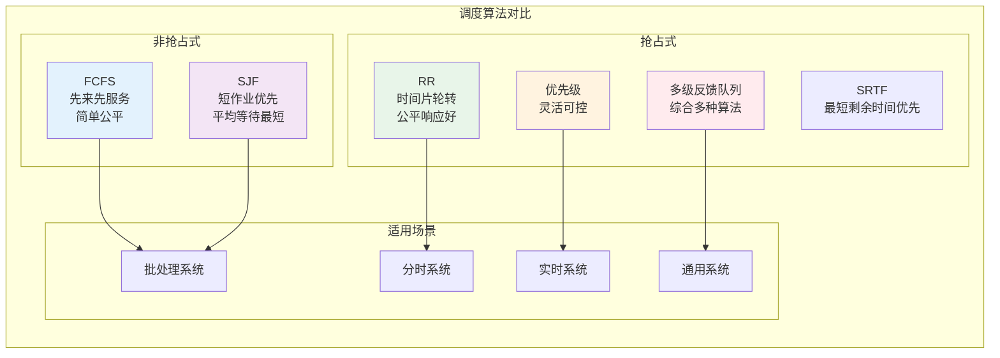

| 算法 | 类型 | 特点 | 适用场景 |
|------|------|------|----------|
| FCFS | 非抢占 | 简单，公平 | 批处理系统 |
| SJF | 非抢占 | 平均等待时间最短 | 作业调度 |
| SRTF | 抢占 | SJF的抢占版本 | 需要预知执行时间 |
| RR | 抢占 | 公平，响应好 | 分时系统 |
| 优先级 | 可抢占/非抢占 | 灵活 | 实时系统 |
| 多级反馈队列 | 抢占 | 综合多种算法 | 通用系统 |

#### 3.3.2 算法性能指标

```python
def calculate_metrics(processes):
    """计算调度算法性能指标"""
    total_turnaround = 0
    total_waiting = 0
    
    for p in processes:
        # 周转时间 = 完成时间 - 到达时间
        turnaround = p.end_time - p.start_time
        # 等待时间 = 周转时间 - 执行时间
        waiting = turnaround - p.cpu_time
        
        total_turnaround += turnaround
        total_waiting += waiting
    
    n = len(processes)
    return {
        'avg_turnaround': total_turnaround / n,
        'avg_waiting': total_waiting / n,
        'throughput': n / (processes[-1].end_time - processes[0].start_time)
    }
```

### 3.4 实现优先级调度

作为练习，让我们实现一个优先级调度器：

```python
class PriorityScheduler(Scheduler):
    """优先级调度器
    
    高优先级的进程先执行
    """
    
    def __init__(self):
        super().__init__()
        # 使用优先队列替代普通队列
        import heapq
        self.ready_queue = []  # (priority, counter, process)
        self.counter = 0
    
    def add_process(self, process: Process):
        """添加进程到就绪队列"""
        # 使用负优先级，因为heapq是最小堆
        heapq.heappush(self.ready_queue, 
                       (-process.priority, self.counter, process))
        self.counter += 1
    
    def _scheduler_loop(self):
        """调度器主循环"""
        while self.running:
            if self.ready_queue:
                # 获取优先级最高的进程
                _, _, process = heapq.heappop(self.ready_queue)
                self._execute_process(process)
            else:
                time.sleep(0.1)
```

### 3.5 实践练习

#### 练习3.1：观察调度过程

```python
# 创建多个进程
for i in range(5):
    system.process_manager.create_process(f"process_{i}")

# 查看就绪队列
print(f"就绪队列大小: {system.scheduler.get_ready_queue_size()}")

# 查看当前运行的进程
current = system.scheduler.get_current_process()
print(f"当前进程: {current}")
```

#### 练习3.2：实现SJF调度

尝试实现最短作业优先（SJF）调度算法：

```python
class SJFScheduler(Scheduler):
    """最短作业优先调度器"""
    
    def add_process(self, process: Process):
        # TODO: 按执行时间排序
        pass
    
    def _scheduler_loop(self):
        # TODO: 选择执行时间最短的进程
        pass
```

#### 思考题

1. 时间片轮转算法中，时间片大小如何影响系统性能？
2. 为什么多级反馈队列算法被广泛使用？
3. 抢占式和非抢占式调度有什么区别？各有什么优缺点？

---

## 第四章：内存管理

### 4.1 内存管理概述

内存管理是操作系统的重要功能，负责内存的分配、回收和保护。

#### 4.1.1 内存管理的功能

1. **内存分配与回收**：为进程分配内存空间
2. **地址转换**：逻辑地址到物理地址的转换
3. **内存保护**：防止进程间的非法访问
4. **内存扩充**：虚拟内存技术

#### 4.1.2 内存分配方式

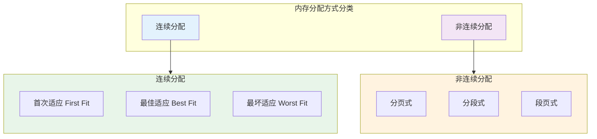

### 4.2 连续内存分配

**代码位置**：`memory/memory_allocator.py`

#### 4.2.1 内存分配算法

```python
class AllocationStrategy(Enum):
    """分配策略枚举"""
    FIRST_FIT = "first_fit"   # 首次适应
    BEST_FIT = "best_fit"     # 最佳适应
    WORST_FIT = "worst_fit"   # 最坏适应

class MemoryAllocator:
    """内存分配器
    
    实现动态内存分配，支持多种分配策略
    """
    
    def __init__(self, total_memory: int = 1024 * 1024, 
                 strategy: AllocationStrategy = AllocationStrategy.FIRST_FIT):
        self.total_memory = total_memory
        self.strategy = strategy
        
        # 内存块链表
        self.head = MemoryBlock(0, total_memory, is_free=True)
```

#### 4.2.2 首次适应算法（First Fit）

```python
def _first_fit(self, size: int) -> Optional[MemoryBlock]:
    """首次适应算法
    
    从内存起始位置开始，查找第一个足够大的空闲块
    """
    current = self.head
    while current:
        if current.is_free and current.size >= size:
            return current
        current = current.next_block
    return None
```

**特点**：
- 时间复杂度：O(n)
- 空间复杂度：O(1)
- 优点：简单高效
- 缺点：容易在内存前端产生碎片

#### 4.2.3 最佳适应算法（Best Fit）

```python
def _best_fit(self, size: int) -> Optional[MemoryBlock]:
    """最佳适应算法
    
    找到大小最接近请求的空闲块
    """
    best_block = None
    best_size = float('inf')
    current = self.head
    
    while current:
        if current.is_free and current.size >= size:
            if current.size < best_size:
                best_size = current.size
                best_block = current
        current = current.next_block
    
    return best_block
```

**特点**：
- 时间复杂度：O(n)
- 优点：内存利用率高
- 缺点：产生大量小碎片

#### 4.2.4 最坏适应算法（Worst Fit）

```python
def _worst_fit(self, size: int) -> Optional[MemoryBlock]:
    """最坏适应算法
    
    选择最大的空闲块进行分配
    """
    worst_block = None
    worst_size = 0
    current = self.head
    
    while current:
        if current.is_free and current.size >= size:
            if current.size > worst_size:
                worst_size = current.size
                worst_block = current
        current = current.next_block
    
    return worst_block
```

**特点**：
- 时间复杂度：O(n)
- 优点：减少小碎片
- 缺点：大块内存容易耗尽

### 4.3 内存碎片

#### 4.3.1 内部碎片与外部碎片

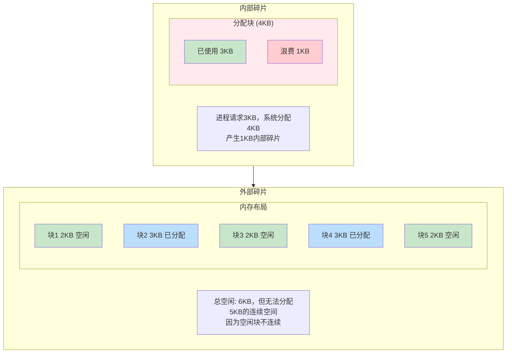

#### 4.3.2 碎片整理

```python
def defragment(self):
    """内存碎片整理
    
    将所有已分配块移动到内存前端，合并空闲空间
    """
    # 1. 收集所有已分配块
    allocated_blocks = []
    current = self.head
    while current:
        if not current.is_free:
            allocated_blocks.append(current)
        current = current.next_block
    
    # 2. 重新排列到内存前部
    new_address = 0
    for block in allocated_blocks:
        block.start_address = new_address
        new_address += block.size
    
    # 3. 创建大空闲块
    free_size = self.total_memory - new_address
    if free_size > 0:
        free_block = MemoryBlock(new_address, free_size, is_free=True)
```

### 4.4 实践练习

#### 练习4.1：内存分配演示

```python
from memory.memory_allocator import MemoryAllocator, AllocationStrategy

# 创建1MB内存，使用首次适应算法
allocator = MemoryAllocator(1024 * 1024, AllocationStrategy.FIRST_FIT)

# 分配内存
addr1 = allocator.allocate(1024, process_id=1)    # 1KB
addr2 = allocator.allocate(2048, process_id=1)    # 2KB
addr3 = allocator.allocate(4096, process_id=2)    # 4KB

print(f"分配地址: {addr1}, {addr2}, {addr3}")

# 查看内存映射
allocator.print_memory_map()

# 释放内存
allocator.deallocate(addr2)

# 再次查看
allocator.print_memory_map()
```

#### 练习4.2：比较分配算法

```python
def test_allocation_strategy(strategy, requests):
    """测试不同分配策略"""
    allocator = MemoryAllocator(1024, strategy)
    
    addresses = []
    for size in requests:
        addr = allocator.allocate(size)
        addresses.append(addr)
    
    stats = allocator.get_memory_stats()
    print(f"策略: {strategy.value}")
    print(f"分配次数: {stats['allocation_count']}")
    print(f"碎片整理次数: {stats['fragmentation_count']}")
    print(f"利用率: {stats['utilization']:.1f}%")
    print()

# 测试
requests = [100, 200, 50, 150, 80, 120]
for strategy in AllocationStrategy:
    test_allocation_strategy(strategy, requests)
```

#### 思考题

1. 三种分配算法各有什么优缺点？适用于什么场景？
2. 如何减少内存碎片？
3. 为什么现代操作系统主要使用分页而不是连续分配？

---

## 第五章：虚拟内存

### 5.1 虚拟内存的概念

虚拟内存是一种内存管理技术，使程序可以使用的内存空间超过物理内存的实际大小。

#### 5.1.1 虚拟内存的优点

1. **更大的地址空间**：程序可以使用比物理内存更大的地址空间
2. **内存保护**：每个进程有独立的地址空间
3. **内存共享**：多个进程可以共享同一块内存
4. **高效利用**：只加载需要的页面

#### 5.1.2 分页机制

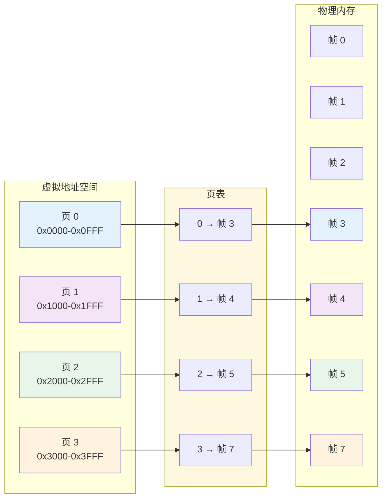

### 5.2 页面与页表

**代码位置**：`memory/virtual_memory.py`

#### 5.2.1 页面类

```python
class Page:
    """内存页面类
    
    表示虚拟内存中的一个页面，通常大小为4KB
    """
    
    def __init__(self, page_number: int, size: int = 4096):
        self.page_number = page_number      # 页面编号
        self.size = size                    # 页面大小
        self.state = PageState.FREE         # 页面状态
        self.process_id = None              # 占用进程ID
        self.frame_number = None            # 映射的物理帧号
        self.access_time = 0                # 访问时间（LRU用）
        self.modified = False               # 修改位（脏页）
        self.reference_bit = False          # 引用位（Clock用）
```

#### 5.2.2 虚拟内存管理器

```python
class VirtualMemory:
    """虚拟内存管理器
    
    实现完整的虚拟内存管理功能
    """
    
    def __init__(self, physical_memory_size: int = 1024 * 1024,
                 page_size: int = 4096,
                 replacement_algorithm = PageReplacementAlgorithm.LRU):
        self.physical_memory_size = physical_memory_size
        self.page_size = page_size
        self.total_pages = physical_memory_size // page_size
        
        # 物理内存帧
        self.physical_frames = [None] * self.total_pages
        
        # 页表（进程ID -> 页面表）
        self.page_tables = {}
        
        # 空闲页面列表
        self.free_pages = list(range(self.total_pages))
        
        # 页面置换算法
        self.page_replacement = PageReplacementFactory.create_algorithm(
            replacement_algorithm, self
        )
```

### 5.3 地址转换

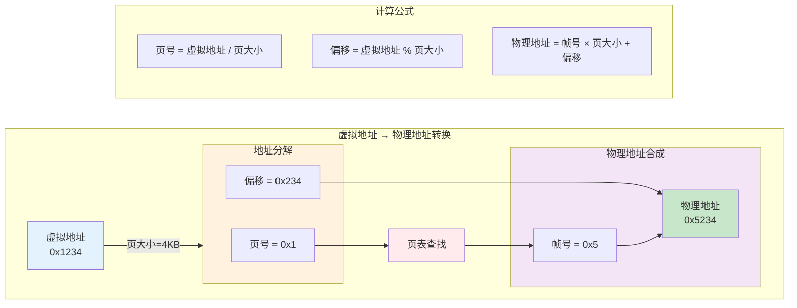

```python
def access_memory(self, process_id: int, virtual_address: int, 
                  is_write: bool = False) -> bool:
    """访问虚拟内存地址
    
    将虚拟地址转换为物理地址
    """
    # 计算页号和页内偏移
    page_number = virtual_address // self.page_size
    offset = virtual_address % self.page_size
    
    # 检查页面是否存在
    if page_number not in self.page_tables[process_id]:
        # 缺页中断
        self.page_faults += 1
        return self._handle_page_fault(process_id, page_number)
    
    # 页面存在，更新访问信息
    page = self.page_tables[process_id][page_number]
    page.access_time = time.time()
    page.reference_bit = True
    if is_write:
        page.modified = True
    
    # 计算物理地址
    physical_address = page.frame_number * self.page_size + offset
    return True
```

### 5.4 页面置换算法

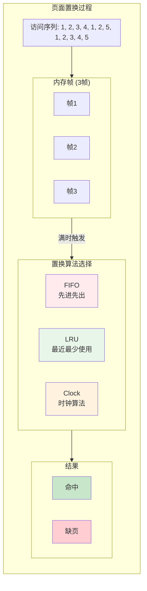

**代码位置**：`memory/page_replacement.py`

#### 5.4.1 FIFO算法

```python
class FIFOStrategy(PageReplacementStrategy):
    """先进先出页面置换算法
    
    选择最早进入内存的页面进行置换
    """
    
    def __init__(self, virtual_memory):
        super().__init__(virtual_memory)
        self.page_queue = deque()  # 页面进入顺序队列
    
    def select_victim(self) -> Tuple[Page, int]:
        """选择队列头部的页面"""
        if not self.page_queue:
            return None
        
        frame_number = self.page_queue.popleft()
        page = self.virtual_memory.physical_frames[frame_number]
        return (page, frame_number)
```

**FIFO的Belady异常**：增加物理页帧数反而可能导致缺页率上升

#### 5.4.2 LRU算法

```python
class LRUStrategy(PageReplacementStrategy):
    """最近最少使用页面置换算法
    
    选择最久未被访问的页面进行置换
    """
    
    def select_victim(self) -> Tuple[Page, int]:
        """选择访问时间最早的页面"""
        lru_page = None
        lru_frame = None
        oldest_time = float('inf')
        
        for frame_idx, page in enumerate(self.virtual_memory.physical_frames):
            if page and page.access_time < oldest_time:
                oldest_time = page.access_time
                lru_page = page
                lru_frame = frame_idx
        
        return (lru_page, lru_frame)
    
    def update_reference(self, page: Page):
        """更新页面访问时间"""
        page.access_time = time.time()
```

**LRU的特点**：
- 优点：性能好，接近最优
- 缺点：实现开销大，需要记录访问时间

#### 5.4.3 Clock算法

```python
class ClockStrategy(PageReplacementStrategy):
    """时钟页面置换算法
    
    使用循环队列和引用位，近似LRU
    """
    
    def __init__(self, virtual_memory):
        super().__init__(virtual_memory)
        self.clock_hand = 0  # 时钟指针
    
    def select_victim(self) -> Tuple[Page, int]:
        """扫描寻找引用位为0的页面"""
        while True:
            page = self.virtual_memory.physical_frames[self.clock_hand]
            
            if page is None:
                # 空闲帧
                frame = self.clock_hand
                self._advance_hand()
                return (None, frame)
            
            if not page.reference_bit:
                # 引用位为0，选择此页面
                frame = self.clock_hand
                self._advance_hand()
                return (page, frame)
            else:
                # 引用位为1，重置并继续
                page.reference_bit = False
                self._advance_hand()
    
    def _advance_hand(self):
        """移动时钟指针"""
        self.clock_hand = (self.clock_hand + 1) % len(
            self.virtual_memory.physical_frames
        )
```

### 5.5 缺页中断

```python
def _handle_page_fault(self, process_id: int, page_number: int) -> bool:
    """处理缺页中断
    
    1. 查找空闲物理帧
    2. 若无空闲帧，执行页面置换
    3. 加载新页面
    """
    # 1. 查找空闲帧
    if self.free_pages:
        frame_number = self.free_pages.pop(0)
        # 创建新页面并映射
        page = Page(page_number, self.page_size)
        page.state = PageState.ALLOCATED
        page.process_id = process_id
        page.frame_number = frame_number
        self.physical_frames[frame_number] = page
        self.page_tables[process_id][page_number] = page
        return True
    
    # 2. 无空闲帧，执行页面置换
    victim_result = self.page_replacement.select_victim()
    if victim_result is None:
        return False
    
    victim_page, victim_frame = victim_result
    
    # 3. 置换页面
    if victim_page:
        # 从原进程页表移除
        old_pid = victim_page.process_id
        old_page_num = victim_page.page_number
        if old_pid in self.page_tables:
            self.page_tables[old_pid].pop(old_page_num, None)
    
    # 加载新页面
    new_page = Page(page_number, self.page_size)
    new_page.state = PageState.ALLOCATED
    new_page.process_id = process_id
    new_page.frame_number = victim_frame
    self.physical_frames[victim_frame] = new_page
    self.page_tables[process_id][page_number] = new_page
    
    return True
```

### 5.6 实践练习

#### 练习5.1：虚拟内存演示

```python
from memory.virtual_memory import VirtualMemory, PageReplacementAlgorithm

# 创建虚拟内存（64KB物理内存，4KB页面）
vm = VirtualMemory(
    physical_memory_size=64 * 1024,
    page_size=4096,
    replacement_algorithm=PageReplacementAlgorithm.LRU
)

# 为进程1分配3个页面
vm.allocate_pages(1, 3)

# 访问内存
for i in range(10):
    vm.access_memory(1, i * 4096)  # 访问不同的页面

# 查看统计信息
stats = vm.get_memory_stats()
print(f"缺页次数: {stats['page_faults']}")
print(f"命中次数: {stats['page_hits']}")
print(f"缺页率: {stats['fault_rate']:.2%}")
```

#### 练习5.2：比较置换算法

```python
from memory.page_replacement import AlgorithmAnalyzer

# 创建分析器
analyzer = AlgorithmAnalyzer()

# 定义访问模式
access_pattern = [0, 1, 2, 3, 0, 1, 4, 5, 0, 1, 2, 3, 4, 5]

# 比较算法
results = analyzer.compare_algorithms(access_pattern, memory_size=4)

# 打印结果
analyzer.print_comparison(results)
```

#### 思考题

1. 为什么需要虚拟内存？它解决了什么问题？
2. 比较FIFO、LRU和Clock算法的优缺点。
3. 什么是Belady异常？哪种算法会出现？

---

## 第六章：文件系统

### 6.1 文件系统概述

文件系统是操作系统用于组织和管理存储设备上数据的机制。

#### 6.1.1 文件系统的功能

1. **文件管理**：创建、删除、读写文件
2. **目录管理**：组织文件层次结构
3. **存储管理**：分配和管理存储空间
4. **文件保护**：控制文件访问权限

#### 6.1.2 文件系统的层次结构

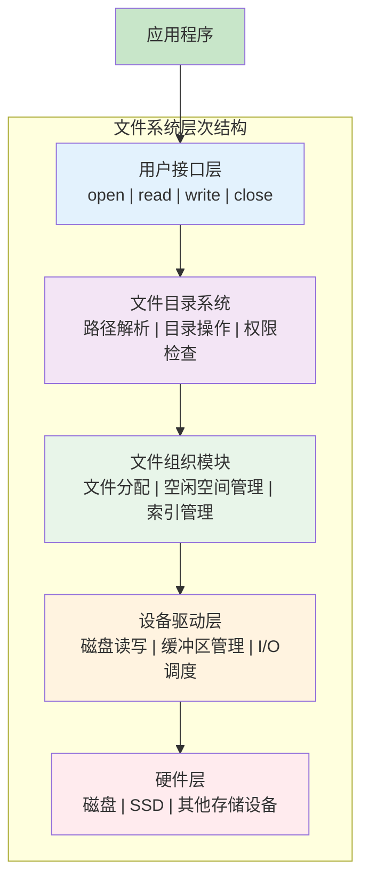

### 6.2 索引节点（Inode）

**代码位置**：`filesystem/inode.py`

```python
class Inode:
    """索引节点
    
    存储文件的元数据，是文件系统中的核心数据结构
    """
    
    def __init__(self, inode_number: int, file_type: FileType):
        self.inode_number = inode_number    # inode编号
        self.file_type = file_type          # 文件类型
        
        # 文件属性
        self.size = 0                       # 文件大小
        self.blocks = 0                     # 占用块数
        self.permissions = 0o644            # 权限
        
        # 时间戳
        self.created_time = time.time()
        self.modified_time = time.time()
        self.accessed_time = time.time()
        
        # 数据块指针
        self.direct_blocks = [-1] * 12      # 12个直接块
        self.single_indirect = -1           # 一级间接块
        self.double_indirect = -1           # 二级间接块
        self.triple_indirect = -1           # 三级间接块
        
        # 链接计数
        self.link_count = 1
```

#### 6.2.1 Inode的地址结构

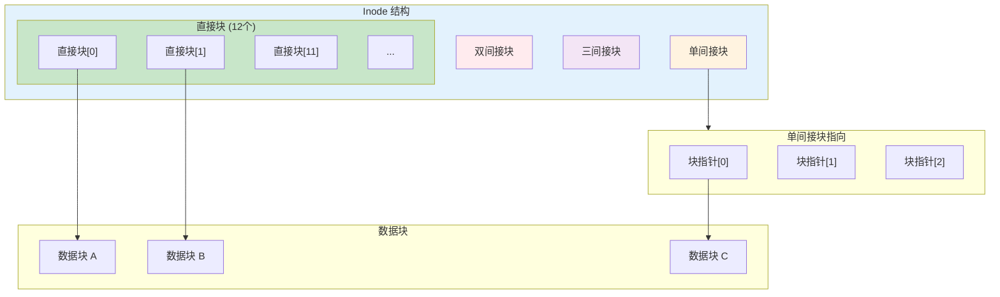

**计算最大文件大小**：
- 假设块大小 = 4KB，块号占4字节
- 直接块：12 × 4KB = 48KB
- 一级间接：1024 × 4KB = 4MB
- 二级间接：1024 × 1024 × 4KB = 4GB
- 三级间接：1024³ × 4KB = 4TB

### 6.3 文件系统核心

**代码位置**：`filesystem/file_system.py`

```python
class FileSystem:
    """文件系统核心
    
    提供文件的创建、读取、写入、删除等功能
    """
    
    def __init__(self):
        self.root_directory = None          # 根目录
        self.current_directory = None       # 当前目录
        self.open_files = {}                # 打开的文件
        self.next_file_descriptor = 1       # 下一个文件描述符
    
    def create_file(self, path: str, content: str = "") -> bool:
        """创建文件"""
        # 1. 解析路径
        dir_path, file_name = self._parse_path(path)
        
        # 2. 检查父目录是否存在
        # 3. 创建文件并写入初始内容
        # 4. 更新统计信息
    
    def read_file(self, path: str) -> str:
        """读取文件内容"""
        pass
    
    def write_file(self, path: str, content: str) -> bool:
        """写入文件内容"""
        pass
```

### 6.4 虚拟文件系统

**代码位置**：`filesystem/vfs.py`

PyOS 实现了一个虚拟文件系统（VFS），提供统一的文件操作接口：

```python
class VirtualFileSystem:
    """虚拟文件系统
    
    提供统一的文件操作接口，隔离具体实现
    """
    
    def __init__(self):
        self.root = Directory("", None)  # 根目录
        self.current_path = "/"
    
    def get_absolute_path(self, base: str, relative: str) -> str:
        """获取绝对路径"""
        if relative.startswith("/"):
            return self._normalize_path(relative)
        return self._normalize_path(f"{base}/{relative}")
    
    def list_directory(self, path: str) -> List[Dict]:
        """列出目录内容"""
        node = self._resolve_path(path)
        if isinstance(node, Directory):
            return node.list()
        return []
    
    def create_file(self, path: str, content: str = "") -> bool:
        """创建文件"""
        pass
    
    def read_file(self, path: str) -> str:
        """读取文件"""
        pass
```

### 6.5 目录管理

**代码位置**：`filesystem/directory.py`

```python
class Directory:
    """目录类
    
    管理文件和子目录的层次结构
    """
    
    def __init__(self, name: str, parent: 'Directory' = None):
        self.name = name
        self.parent = parent
        self.children = {}  # name -> File/Directory
        self.created_time = time.time()
    
    def add_entry(self, name: str, entry):
        """添加目录项"""
        self.children[name] = entry
    
    def remove_entry(self, name: str) -> bool:
        """删除目录项"""
        if name in self.children:
            del self.children[name]
            return True
        return False
    
    def get_entry(self, name: str):
        """获取目录项"""
        return self.children.get(name)
    
    def list(self) -> List[Dict]:
        """列出目录内容"""
        result = []
        for name, entry in self.children.items():
            entry_type = "directory" if isinstance(entry, Directory) else "file"
            result.append({
                'name': name,
                'type': entry_type,
                'size': getattr(entry, 'size', 0)
            })
        return result
```

### 6.6 实践练习

#### 练习6.1：文件操作

```python
from filesystem.vfs import VirtualFileSystem

# 创建虚拟文件系统
vfs = VirtualFileSystem()

# 创建目录
vfs.create_directory("/home")
vfs.create_directory("/home/user")

# 创建文件
vfs.create_file("/home/user/hello.txt", "Hello, PyOS!")

# 读取文件
content = vfs.read_file("/home/user/hello.txt")
print(f"文件内容: {content}")

# 列出目录
entries = vfs.list_directory("/home/user")
for entry in entries:
    print(f"{entry['type']}: {entry['name']}")
```

#### 练习6.2：实现文件复制

尝试实现一个文件复制功能：

```python
def copy_file(vfs, src_path: str, dst_path: str) -> bool:
    """复制文件"""
    # TODO: 读取源文件内容
    # TODO: 创建目标文件
    # TODO: 写入内容
    pass
```

#### 思考题

1. Inode和文件名有什么关系？为什么需要Inode？
2. 硬链接和软链接有什么区别？
3. 文件系统如何管理空闲空间？

---

## 第七章：设备管理

### 7.1 设备管理概述

设备管理负责管理和控制计算机系统中的各种I/O设备。

#### 7.1.1 设备分类

| 类型 | 特点 | 示例 |
|------|------|------|
| 块设备 | 随机访问，块为单位 | 硬盘、SSD |
| 字符设备 | 顺序访问，字符为单位 | 键盘、鼠标 |
| 网络设备 | 网络通信 | 网卡 |

#### 7.1.2 设备管理的功能

1. **设备分配**：分配设备给进程
2. **设备控制**：控制设备的操作
3. **中断处理**：处理设备中断
4. **缓冲管理**：管理I/O缓冲区

### 7.2 设备管理器

**代码位置**：`device/device_manager.py`

```python
class Device:
    """设备基类"""
    
    def __init__(self, device_id: str, device_type: str, name: str):
        self.device_id = device_id
        self.device_type = device_type
        self.name = name
        self.is_active = False
        self.properties = {}
    
    def initialize(self) -> bool:
        """初始化设备"""
        self.is_active = True
        return True
    
    def shutdown(self) -> bool:
        """关闭设备"""
        self.is_active = False
        return True
    
    def get_status(self) -> Dict:
        """获取设备状态"""
        return {
            'device_id': self.device_id,
            'device_type': self.device_type,
            'name': self.name,
            'is_active': self.is_active
        }

class DeviceManager:
    """设备管理器
    
    管理系统中的所有设备
    """
    
    def __init__(self):
        self.devices = {}              # 设备ID -> 设备
        self.device_types = {}         # 设备类型 -> 设备ID列表
    
    def register_device(self, device: Device) -> bool:
        """注册设备"""
        if device.device_id in self.devices:
            return False
        
        self.devices[device.device_id] = device
        
        # 按类型索引
        if device.device_type not in self.device_types:
            self.device_types[device.device_type] = []
        self.device_types[device.device_type].append(device.device_id)
        
        return True
    
    def get_device(self, device_id: str) -> Optional[Device]:
        """获取设备"""
        return self.devices.get(device_id)
    
    def get_devices_by_type(self, device_type: str) -> List[Device]:
        """按类型获取设备"""
        device_ids = self.device_types.get(device_type, [])
        return [self.devices[did] for did in device_ids]
```

### 7.3 设备驱动示例

#### 7.3.1 终端设备

**代码位置**：`device/terminal.py`

```python
class Terminal(Device):
    """终端设备"""
    
    def __init__(self):
        super().__init__("terminal_0", "terminal", "System Terminal")
        self.buffer = []
    
    def write(self, data: str):
        """输出数据"""
        self.buffer.append(data)
        print(data, end='')
    
    def read(self) -> str:
        """读取输入"""
        return input()
```

#### 7.3.2 键盘设备

**代码位置**：`device/keyboard.py`

```python
class Keyboard(Device):
    """键盘设备"""
    
    def __init__(self):
        super().__init__("keyboard_0", "keyboard", "System Keyboard")
        self.buffer = queue.Queue()
    
    def put_key(self, key: str):
        """放入按键"""
        self.buffer.put(key)
    
    def get_key(self, timeout: float = None) -> Optional[str]:
        """获取按键"""
        try:
            return self.buffer.get(timeout=timeout)
        except queue.Empty:
            return None
```

### 7.4 实践练习

#### 练习7.1：查看系统设备

```python
from device.device_manager import DeviceManager

# 创建设备管理器
dm = DeviceManager()
dm.initialize()

# 查看所有设备
devices = dm.get_all_devices()
for device in devices:
    print(f"{device.device_id}: {device.name} ({device.device_type})")

# 按类型查看
terminals = dm.get_devices_by_type("terminal")
print(f"\n终端设备数: {len(terminals)}")
```

#### 思考题

1. 为什么需要设备驱动程序？
2. 阻塞I/O和非阻塞I/O有什么区别？
3. 设备控制器的作用是什么？

---

## 第八章：中断与系统调用

### 8.1 中断的概念

中断是操作系统实现多任务和响应外部事件的关键机制。

#### 8.1.1 中断类型

| 类型 | 来源 | 示例 |
|------|------|------|
| 硬件中断 | 外部设备 | 时钟中断、I/O完成 |
| 软件中断 | 程序执行 | 系统调用、异常 |
| 异常 | 程序错误 | 除零、缺页 |

#### 8.1.2 中断处理过程

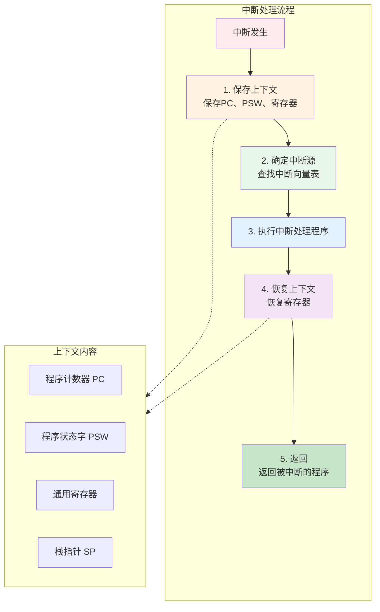

### 8.2 中断处理器

**代码位置**：`kernel/interrupt.py`

```python
class InterruptType(Enum):
    """中断类型枚举"""
    TIMER = "timer"              # 时钟中断
    I_O = "io"                   # I/O中断
    SYSTEM_CALL = "system_call"  # 系统调用
    PAGE_FAULT = "page_fault"    # 缺页中断
    DIVIDE_BY_ZERO = "divide_by_zero"  # 除零异常

class InterruptHandler:
    """中断处理器"""
    
    def __init__(self):
        self.interrupt_handlers = {}  # 中断类型 -> 处理程序列表
        self.interrupt_queue = []     # 中断队列
        self.interrupt_enabled = True # 中断使能
    
    def register_handler(self, interrupt_type: InterruptType, 
                         handler: Callable):
        """注册中断处理程序"""
        if interrupt_type not in self.interrupt_handlers:
            self.interrupt_handlers[interrupt_type] = []
        self.interrupt_handlers[interrupt_type].append(handler)
    
    def raise_interrupt(self, interrupt_type: InterruptType, 
                        data: Any = None):
        """触发中断"""
        interrupt = {
            'type': interrupt_type,
            'data': data,
            'timestamp': time.time()
        }
        self.interrupt_queue.append(interrupt)
    
    def handle_interrupts(self):
        """处理中断队列"""
        while self.interrupt_queue and self.interrupt_enabled:
            interrupt = self.interrupt_queue.pop(0)
            self._process_interrupt(interrupt)
    
    def _process_interrupt(self, interrupt: Dict):
        """处理单个中断"""
        interrupt_type = interrupt['type']
        data = interrupt['data']
        
        if interrupt_type in self.interrupt_handlers:
            for handler in self.interrupt_handlers[interrupt_type]:
                handler(data)
```

### 8.3 系统调用

系统调用是用户程序请求操作系统服务的接口。

#### 8.3.1 系统调用的类型

**代码位置**：`kernel/system_call.py`

```python
class SystemCallType(Enum):
    """系统调用类型"""
    # 进程相关
    FORK = "fork"       # 创建进程
    EXEC = "exec"       # 执行程序
    EXIT = "exit"       # 退出进程
    WAIT = "wait"       # 等待进程
    GETPID = "getpid"   # 获取进程ID
    
    # 文件相关
    OPEN = "open"       # 打开文件
    READ = "read"       # 读取文件
    WRITE = "write"     # 写入文件
    CLOSE = "close"     # 关闭文件
    
    # 内存相关
    BRK = "brk"         # 调整堆大小
    MMAP = "mmap"       # 内存映射
    
    # 其他
    TIME = "time"       # 获取时间
    SLEEP = "sleep"     # 睡眠
```

#### 8.3.2 系统调用处理器

```python
class SystemCall:
    """系统调用处理器"""
    
    def __init__(self):
        self.system_calls = {}  # 系统调用类型 -> 处理函数
        self._init_system_calls()
    
    def register_system_call(self, call_type: SystemCallType, 
                             handler: Callable):
        """注册系统调用处理程序"""
        self.system_calls[call_type] = handler
    
    def call(self, call_type: SystemCallType, *args, **kwargs) -> Any:
        """执行系统调用"""
        if call_type in self.system_calls:
            return self.system_calls[call_type](*args, **kwargs)
        raise NotImplementedError(f"未实现的系统调用: {call_type}")
    
    # 默认系统调用实现
    def _getpid(self) -> int:
        return 1  # 当前进程ID
    
    def _time(self) -> float:
        return time.time()
    
    def _sleep(self, seconds: float):
        time.sleep(seconds)
```

### 8.4 系统调用过程

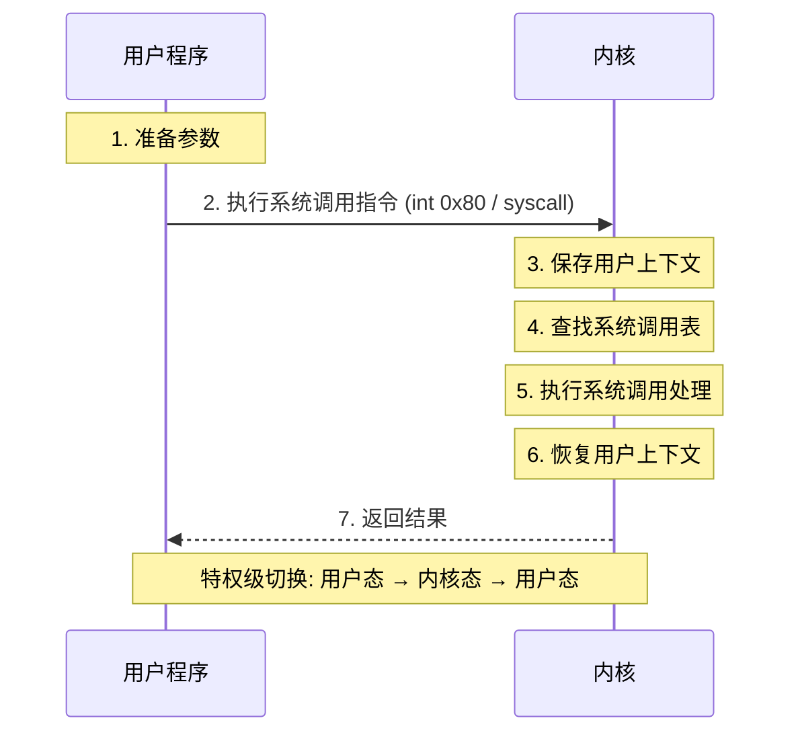

### 8.5 实践练习

#### 练习8.1：注册中断处理程序

```python
from kernel.interrupt import InterruptHandler, InterruptType

# 创建中断处理器
handler = InterruptHandler()

# 定义处理函数
def timer_handler(data):
    print(f"时钟中断: {data}")

def page_fault_handler(data):
    print(f"缺页中断: 地址 {data}")

# 注册处理程序
handler.register_handler(InterruptType.TIMER, timer_handler)
handler.register_handler(InterruptType.PAGE_FAULT, page_fault_handler)

# 触发中断
handler.raise_interrupt(InterruptType.TIMER, "tick")
handler.raise_interrupt(InterruptType.PAGE_FAULT, 0x1000)

# 处理中断
handler.handle_interrupts()
```

#### 练习8.2：实现自定义系统调用

```python
from kernel.system_call import SystemCall, SystemCallType

# 创建系统调用处理器
syscall = SystemCall()

# 定义自定义系统调用
def my_syscall(message: str) -> str:
    return f"处理消息: {message}"

# 注册系统调用
syscall.register_system_call(SystemCallType.TIME, my_syscall)

# 调用
result = syscall.call(SystemCallType.TIME, "Hello")
print(result)
```

#### 思考题

1. 中断和系统调用有什么区别？
2. 为什么系统调用需要从用户态切换到内核态？
3. 如何保证中断处理的原子性？

---

## 第九章：进程同步

### 9.1 同步的基本概念

在多进程/多线程环境中，多个执行流可能同时访问共享资源，需要同步机制来保证正确性。

#### 9.1.1 竞态条件

```python
# 竞态条件示例
counter = 0

def increment():
    global counter
    for _ in range(100000):
        counter += 1  # 非原子操作！

# 两个线程同时执行
t1 = threading.Thread(target=increment)
t2 = threading.Thread(target=increment)
t1.start(); t2.start()
t1.join(); t2.join()

print(counter)  # 预期200000，实际可能小于
```

#### 9.1.2 临界区

临界区是访问共享资源的代码段，需要满足以下条件：

1. **互斥**：一次只允许一个进程进入
2. **有限等待**：不能无限等待
3. **空闲让进**：无进程在临界区时，应允许进入
4. **让权等待**：不能进入时应释放CPU

### 9.2 信号量

**代码位置**：`sync/semaphore.py`

信号量是最经典的同步原语，由Dijkstra提出。

#### 9.2.1 信号量的定义

```python
class Semaphore:
    """通用信号量实现"""
    
    def __init__(self, value: int = 1, name: str = ""):
        if value < 0:
            raise ValueError("信号量初始值不能为负数")
        
        self._value = value
        self._lock = threading.Lock()
        self._wait_queue = deque()  # 等待队列
    
    def acquire(self, timeout: Optional[float] = None) -> bool:
        """P操作 - 申请资源"""
        with self._lock:
            if self._value > 0:
                self._value -= 1
                return True
            
            # 需要等待
            event = threading.Event()
            self._wait_queue.append(event)
        
        # 在锁外等待
        return event.wait(timeout=timeout)
    
    def release(self):
        """V操作 - 释放资源"""
        with self._lock:
            if self._wait_queue:
                # 唤醒等待的进程
                event = self._wait_queue.popleft()
                event.set()
            else:
                self._value += 1
    
    # 别名
    def P(self): return self.acquire()
    def V(self): self.release()
```

#### 9.2.2 信号量的应用

**互斥访问**：
```python
mutex = Semaphore(1)  # 二进制信号量

def critical_section():
    mutex.P()          # 进入临界区
    try:
        # 访问共享资源
        pass
    finally:
        mutex.V()      # 离开临界区
```

**控制并发数**：
```python
pool = Semaphore(5)  # 最多5个并发

def access_resource():
    pool.P()
    try:
        # 访问有限资源
        pass
    finally:
        pool.V()
```

### 9.3 互斥锁

**代码位置**：`sync/mutex.py`

```python
class Mutex:
    """互斥锁
    
    与二进制信号量类似，但只能由持有者释放
    """
    
    def __init__(self, name: str = ""):
        self._lock = threading.Lock()
        self._owner = None          # 当前持有者
        self._name = name
        self._lock_count = 0        # 重入计数
    
    def lock(self):
        """获取锁"""
        self._lock.acquire()
        self._owner = threading.current_thread()
        self._lock_count += 1
    
    def unlock(self):
        """释放锁"""
        if self._owner != threading.current_thread():
            raise RuntimeError("非锁持有者尝试释放")
        
        self._lock_count -= 1
        if self._lock_count == 0:
            self._owner = None
        self._lock.release()
    
    def __enter__(self):
        self.lock()
        return self
    
    def __exit__(self, *args):
        self.unlock()
```

### 9.4 条件变量

**代码位置**：`sync/condition.py`

条件变量用于等待特定条件成立。

```python
class Condition:
    """条件变量"""
    
    def __init__(self, lock: Mutex = None):
        self._lock = lock or Mutex()
        self._waiters = []  # 等待队列
    
    def wait(self):
        """等待条件"""
        # 释放锁并等待
        waiter = threading.Event()
        self._waiters.append(waiter)
        self._lock.unlock()
        
        waiter.wait()  # 阻塞等待
        
        # 被唤醒后重新获取锁
        self._lock.lock()
    
    def notify(self):
        """唤醒一个等待者"""
        if self._waiters:
            waiter = self._waiters.pop(0)
            waiter.set()
    
    def notify_all(self):
        """唤醒所有等待者"""
        for waiter in self._waiters:
            waiter.set()
        self._waiters.clear()
```

### 9.5 经典同步问题

**代码位置**：`sync/classic_problems.py`

#### 9.5.1 生产者-消费者问题

```mermaid
flowchart TB
    subgraph 生产者消费者模型["生产者-消费者模型"]
        direction TB

        subgraph 生产者["生产者"]
            P1["生产者1"]
            P2["生产者2"]
        end

        subgraph 缓冲区["缓冲区 (大小=N)"]
            B1["产品1"]
            B2["产品2"]
            B3["..."]
            B4["产品N"]
        end

        subgraph 消费者["消费者"]
            C1["消费者1"]
            C2["消费者2"]
        end

        subgraph 信号量["信号量控制"]
            MUTEX["mutex = 1
互斥访问缓冲区"]
            EMPTY["empty = N
空槽位数"]
            FULL["full = 0
产品数量"]
        end

        P1 -->|P(empty)| 缓冲区
        P2 -->|P(empty)| 缓冲区
        缓冲区 -->|P(full)| C1
        缓冲区 -->|P(full)| C2

        MUTEX -.->|控制| 缓冲区
        EMPTY -.->|控制| 缓冲区
        FULL -.->|控制| 缓冲区
    end

    style 生产者 fill:#c8e6c9
    style 消费者 fill:#bbdefb
    style 缓冲区 fill:#fff3e0
    style MUTEX fill:#f3e5f5
    style EMPTY fill:#e8f5e9
    style FULL fill:#ffebee
```

```python
class ProducerConsumer:
    """生产者-消费者问题"""
    
    def __init__(self, buffer_size: int = 10):
        self.buffer = []
        self.buffer_size = buffer_size
        
        self.mutex = Semaphore(1)       # 互斥访问缓冲区
        self.empty = Semaphore(buffer_size)  # 空槽位数
        self.full = Semaphore(0)        # 产品数
    
    def produce(self, item):
        """生产者"""
        self.empty.P()      # 等待空槽位
        self.mutex.P()      # 进入临界区
        try:
            self.buffer.append(item)
        finally:
            self.mutex.V()  # 离开临界区
            self.full.V()   # 增加产品数
    
    def consume(self):
        """消费者"""
        self.full.P()       # 等待产品
        self.mutex.P()      # 进入临界区
        try:
            item = self.buffer.pop(0)
            return item
        finally:
            self.mutex.V()  # 离开临界区
            self.empty.V()  # 增加空槽位
```

#### 9.5.2 读者-写者问题

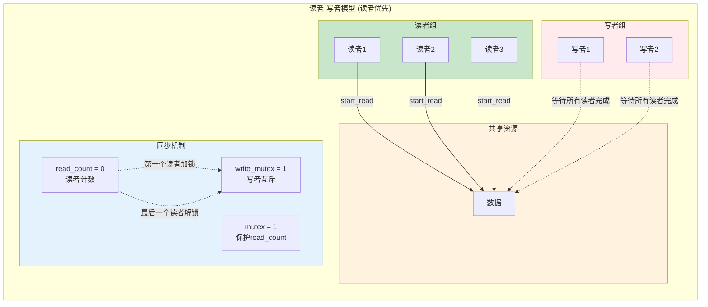

```python
class ReadersWriters:
    """读者-写者问题（读者优先）"""
    
    def __init__(self):
        self.readers = 0
        self.mutex = Semaphore(1)   # 保护readers计数
        self.write_mutex = Semaphore(1)  # 写者互斥
    
    def start_read(self):
        """开始读"""
        self.mutex.P()
        self.readers += 1
        if self.readers == 1:  # 第一个读者
            self.write_mutex.P()
        self.mutex.V()
    
    def end_read(self):
        """结束读"""
        self.mutex.P()
        self.readers -= 1
        if self.readers == 0:  # 最后一个读者
            self.write_mutex.V()
        self.mutex.V()
    
    def start_write(self):
        """开始写"""
        self.write_mutex.P()
    
    def end_write(self):
        """结束写"""
        self.write_mutex.V()
```

### 9.6 实践练习

#### 练习9.1：使用信号量实现互斥

```python
from sync.semaphore import Semaphore

# 创建二进制信号量
mutex = Semaphore(1, "my_mutex")

counter = 0

def safe_increment():
    global counter
    for _ in range(10000):
        mutex.P()
        counter += 1
        mutex.V()

# 测试
import threading
threads = [threading.Thread(target=safe_increment) for _ in range(5)]
for t in threads:
    t.start()
for t in threads:
    t.join()

print(f"Counter: {counter}")  # 应该是50000
```

#### 练习9.2：实现哲学家就餐问题

尝试使用信号量解决哲学家就餐问题：

```python
class DiningPhilosophers:
    def __init__(self, n=5):
        # TODO: 实现哲学家就餐问题
        pass
    
    def take_forks(self, i):
        # TODO: 拿起叉子
        pass
    
    def put_forks(self, i):
        # TODO: 放下叉子
        pass
```

#### 思考题

1. 信号量和互斥锁有什么区别？
2. 为什么条件变量需要配合互斥锁使用？
3. 读者-写者问题中，如何实现写者优先？

---

## 第十章：死锁

### 10.1 死锁的概念

死锁是指两个或多个进程互相等待对方释放资源，导致都无法继续执行。

#### 10.1.1 死锁的四个必要条件

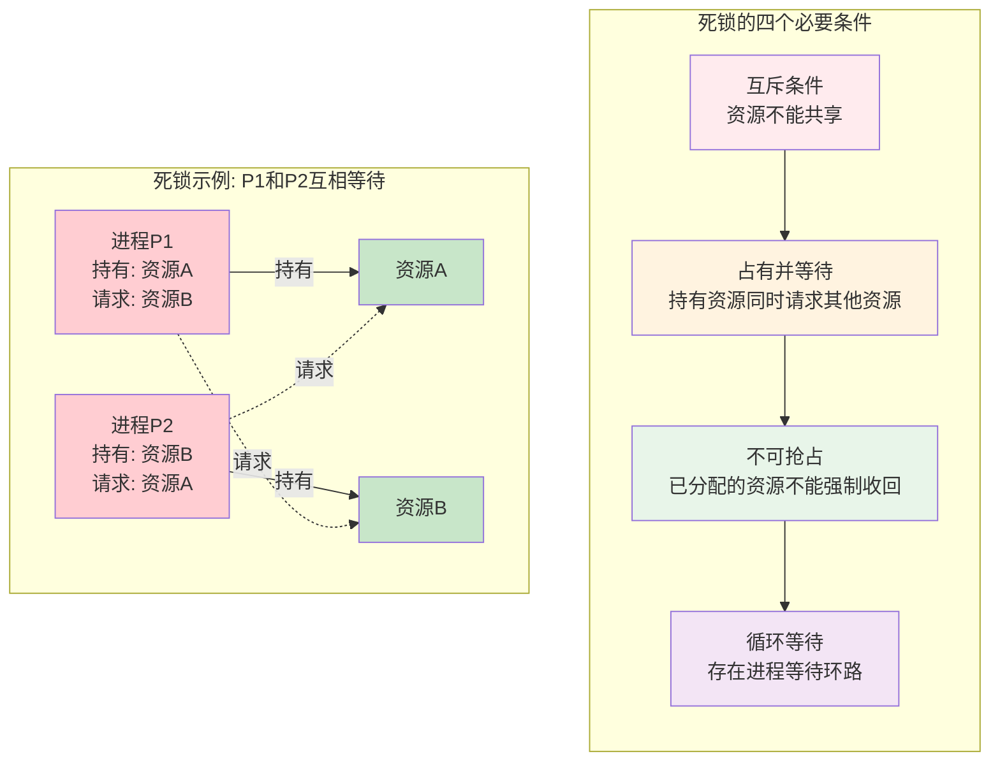

1. **互斥条件**：资源不能共享
2. **占有并等待**：持有资源同时请求其他资源
3. **不可抢占**：已分配的资源不能强制收回
4. **循环等待**：存在进程等待环路

#### 10.1.2 死锁示例

```python
# 死锁示例
lock1 = threading.Lock()
lock2 = threading.Lock()

def thread1():
    lock1.acquire()
    time.sleep(0.1)
    lock2.acquire()  # 等待lock2，但thread2持有lock2
    lock2.release()
    lock1.release()

def thread2():
    lock2.acquire()
    time.sleep(0.1)
    lock1.acquire()  # 等待lock1，但thread1持有lock1
    lock1.release()
    lock2.release()

# 两个线程互相等待 -> 死锁
```

### 10.2 银行家算法

**代码位置**：`deadlock/banker.py`

银行家算法是一种死锁避免算法。

#### 10.2.1 核心数据结构

```mermaid
flowchart TB
    subgraph 银行家算法数据结构["银行家算法数据结构"]
        direction TB

        subgraph 资源向量["资源向量"]
            TOTAL["Total = [10, 5, 7]
总资源"]
            AVAIL["Available = [3, 3, 2]
可用资源"]
        end

        subgraph 进程矩阵["进程矩阵"]
            subgraph P0["进程P0"]
                A0["Allocation = [0, 1, 0]
已分配"]
                N0["Need = [7, 4, 3]
还需要"]
                M0["Max = [7, 5, 3]
最大需求"]
            end

            subgraph P1["进程P1"]
                A1["Allocation = [2, 0, 0]
已分配"]
                N1["Need = [1, 2, 2]
还需要"]
                M1["Max = [3, 2, 2]
最大需求"]
            end
        end
    end

    subgraph 安全性检查["安全性检查"]
        SC["寻找安全序列
使得每个进程都能获得所需资源完成执行"]
    end

    资源向量 --> 进程矩阵 --> 安全性检查

    style TOTAL fill:#e3f2fd
    style AVAIL fill:#e8f5e9
    style P0 fill:#fff3e0
    style P1 fill:#f3e5f5
    style SC fill:#c8e6c9
```

```python
class BankersAlgorithm:
    """银行家算法实现"""
    
    def __init__(self, resource_types: List[str], 
                 total_resources: List[int]):
        self._resource_types = resource_types  # 资源类型
        self._total = total_resources          # 总资源
        self._available = total_resources[:]   # 可用资源
        self._processes = {}                   # 进程信息
```

#### 10.2.2 安全性检查

```python
def _safety_check(self) -> Tuple[bool, List[str]]:
    """安全性算法
    
    检查系统是否处于安全状态
    """
    # 初始化
    work = self._available[:]
    finish = {pid: False for pid in self._processes}
    safe_sequence = []
    
    # 尝试找到安全序列
    while True:
        found = False
        for pid, process in self._processes.items():
            if not finish[pid]:
                # 检查 Need <= Work
                can_allocate = all(
                    process['need'][i] <= work[i]
                    for i in range(len(self._resource_types))
                )
                
                if can_allocate:
                    # 可以满足这个进程
                    for i in range(len(self._resource_types)):
                        work[i] += process['allocation'][i]
                    finish[pid] = True
                    safe_sequence.append(pid)
                    found = True
        
        if not found:
            break
    
    # 所有进程都能完成 -> 安全状态
    return all(finish.values()), safe_sequence
```

#### 10.2.3 资源请求

```python
def request_resources(self, pid: str, request: List[int]) -> Tuple[bool, str]:
    """请求资源
    
    1. 检查请求是否合法
    2. 试探性分配
    3. 安全性检查
    4. 正式分配或回滚
    """
    process = self._processes[pid]
    
    # 1. 检查请求是否超过最大需求
    for i in range(len(request)):
        if request[i] > process['need'][i]:
            return False, "请求超过声明的最大需求"
    
    # 2. 检查是否有足够资源
    for i in range(len(request)):
        if request[i] > self._available[i]:
            return False, "资源不足"
    
    # 3. 试探性分配
    saved_state = self._save_state()
    for i in range(len(request)):
        self._available[i] -= request[i]
        process['allocation'][i] += request[i]
        process['need'][i] -= request[i]
    
    # 4. 安全性检查
    is_safe, safe_sequence = self._safety_check()
    
    if is_safe:
        return True, f"分配成功，安全序列: {safe_sequence}"
    else:
        # 回滚
        self._restore_state(saved_state)
        return False, "分配会导致不安全状态"
```

### 10.3 死锁检测

**代码位置**：`deadlock/detector.py`

```python
class DeadlockDetector:
    """死锁检测器"""
    
    def __init__(self):
        self.allocation = {}   # 分配矩阵
        self.request = {}      # 请求矩阵
        self.available = []    # 可用资源
    
    def detect(self) -> List[Set[str]]:
        """检测死锁
        
        返回死锁进程组列表
        """
        work = self.available[:]
        finish = {}
        
        # 初始化finish
        for pid in self.allocation:
            # 如果没有分配任何资源，标记为完成
            if all(x == 0 for x in self.allocation[pid]):
                finish[pid] = True
            else:
                finish[pid] = False
        
        # 查找可以完成的进程
        changed = True
        while changed:
            changed = False
            for pid in self.allocation:
                if not finish[pid]:
                    # 检查请求是否可以被满足
                    can_finish = all(
                        self.request[pid][i] <= work[i]
                        for i in range(len(work))
                    )
                    if can_finish:
                        # 释放资源
                        for i in range(len(work)):
                            work[i] += self.allocation[pid][i]
                        finish[pid] = True
                        changed = True
        
        # 未完成的进程即为死锁进程
        deadlocked = {pid for pid, done in finish.items() if not done}
        return [deadlocked] if deadlocked else []
```

### 10.4 实践练习

#### 练习10.1：银行家算法演示

```python
from deadlock.banker import BankersAlgorithm

# 创建银行家算法实例
banker = BankersAlgorithm(
    resource_types=['A', 'B', 'C'],
    total_resources=[10, 5, 7]
)

# 添加进程
banker.add_process('P0', [7, 5, 3])
banker.add_process('P1', [3, 2, 2])
banker.add_process('P2', [9, 0, 2])
banker.add_process('P3', [2, 2, 2])
banker.add_process('P4', [4, 3, 3])

# 请求资源
success, msg = banker.request_resources('P1', [1, 0, 2])
print(f"P1请求[1,0,2]: {msg}")

# 查看状态
banker.print_state()
```

#### 练习10.2：模拟死锁

```python
import threading
import time

def create_deadlock():
    """创建死锁场景"""
    lock1 = threading.Lock()
    lock2 = threading.Lock()
    
    def task1():
        with lock1:
            time.sleep(0.1)
            print("Task1等待lock2")
            with lock2:  # 死锁！
                print("Task1完成")
    
    def task2():
        with lock2:
            time.sleep(0.1)
            print("Task2等待lock1")
            with lock1:  # 死锁！
                print("Task2完成")
    
    t1 = threading.Thread(target=task1)
    t2 = threading.Thread(target=task2)
    t1.start()
    t2.start()
    # t1和t2都无法完成

# 运行后观察死锁现象
```

#### 思考题

1. 死锁的四个必要条件是什么？破坏任何一个是否就能避免死锁？
2. 银行家算法有什么缺点？
3. 死锁预防和死锁避免有什么区别？

---

## 第十一章：线程管理

### 11.1 线程的概念

线程是CPU调度的基本单位，同一进程的线程共享进程资源。

#### 11.1.1 线程与进程的比较

| 特性 | 进程 | 线程 |
|------|------|------|
| 资源 | 独立地址空间 | 共享地址空间 |
| 开销 | 创建/切换开销大 | 开销小 |
| 通信 | 需要IPC | 直接共享内存 |
| 安全 | 相互隔离 | 一个崩溃影响全部 |

### 11.2 线程池

**代码位置**：`thread/thread_pool.py`

```python
class ThreadPool:
    """线程池实现
    
    预先创建一组线程，重复利用执行任务
    """
    
    def __init__(self, max_workers: int = 4, name: str = ""):
        self._max_workers = max_workers
        self._task_queue = queue.Queue()
        self._workers = []
        self._state = PoolState.RUNNING
        
        # 创建工作线程
        self._create_workers()
    
    def _create_workers(self):
        """创建工作线程"""
        for i in range(self._max_workers):
            worker = threading.Thread(
                target=self._worker_loop,
                daemon=True
            )
            worker.start()
            self._workers.append(worker)
    
    def _worker_loop(self):
        """工作线程主循环"""
        while self._state == PoolState.RUNNING:
            try:
                task = self._task_queue.get(timeout=0.5)
                if task is None:  # 停止信号
                    break
                
                future, func, args, kwargs = task
                try:
                    result = func(*args, **kwargs)
                    future.set_result(result)
                except Exception as e:
                    future.set_exception(e)
                    
            except queue.Empty:
                continue
    
    def submit(self, func: Callable, *args, **kwargs) -> Future:
        """提交任务"""
        future = Future()
        self._task_queue.put((future, func, args, kwargs))
        return future
    
    def map(self, func: Callable, iterable: List) -> List:
        """批量执行"""
        futures = [self.submit(func, item) for item in iterable]
        return [f.result() for f in futures]
```

### 11.3 线程模型

```mermaid
flowchart TB
    subgraph 线程模型对比["线程模型对比"]
        direction TB

        subgraph 用户级线程["用户级线程 (ULT)"]
            UAPP["应用程序"]
            UTM["用户线程库
调度、切换在用户空间"]
            UK["内核
不知道线程存在"]

            UAPP --> UTM --> UK
        end

        subgraph 内核级线程["内核级线程 (KLT)"]
            KAPP["应用程序"]
            KTM["线程库"]
            KK["内核线程调度器
每个线程对应一个内核线程"]

            KAPP --> KTM --> KK
        end

        subgraph 混合模型["混合模型"]
            MAPP["应用程序"]
            MUL["用户线程"]
            MKL["内核线程
多对一或一对一映射"]

            MAPP --> MUL --> MKL
        end
    end

    style 用户级线程 fill:#e3f2fd
    style 内核级线程 fill:#f3e5f5
    style 混合模型 fill:#e8f5e9
```

**代码位置**：`thread/thread_models.py`

#### 11.3.1 用户级线程

```python
class UserThread:
    """用户级线程
    
    完全在用户空间管理，内核不知道线程存在
    """
    
    def __init__(self, func: Callable):
        self.func = func
        self.state = "ready"
        self.context = {}
```

#### 11.3.2 内核级线程

```python
class KernelThread:
    """内核级线程
    
    由内核管理，一个线程阻塞不影响其他线程
    """
    
    def __init__(self, func: Callable):
        self.thread = threading.Thread(target=func)
```

### 11.4 实践练习

#### 练习11.1：使用线程池

```python
from thread.thread_pool import ThreadPool

# 创建线程池
pool = ThreadPool(max_workers=4)

# 定义任务
def task(n):
    time.sleep(0.5)
    return n * n

# 提交任务
futures = [pool.submit(task, i) for i in range(10)]

# 获取结果
results = [f.result() for f in futures]
print(f"结果: {results}")

# 使用map
results = pool.map(lambda x: x ** 2, range(10))
print(f"Map结果: {results}")

# 关闭线程池
pool.shutdown()
```

#### 思考题

1. 线程池的优点是什么？
2. 用户级线程和内核级线程各有什么优缺点？
3. 多线程和多进程各适用于什么场景？

---

## 第十二章：I/O系统

### 12.1 I/O系统概述

I/O系统负责管理计算机与外部设备之间的数据传输。

#### 12.1.1 I/O控制方式

| 方式 | 特点 | 适用场景 |
|------|------|----------|
| 程序直接控制 | CPU忙等 | 简单系统 |
| 中断驱动 | CPU可做其他事 | 一般系统 |
| DMA | 批量传输 | 高速设备 |
| 通道 | 独立I/O处理器 | 大型机 |

### 12.2 I/O调度算法

```mermaid
flowchart TB
    subgraph IO调度["I/O调度算法比较"]
        direction TB

        subgraph 请求队列["磁盘请求队列"]
            REQ["请求: [98, 183, 37, 122, 14, 124, 65, 67]
当前磁头位置: 53"]
        end

        subgraph 算法比较["算法寻道距离比较"]
            FCFS["FCFS (先来先服务)
按请求顺序: 53→98→183→37→122→14→124→65→67
总寻道: 640"]

            SSTF["SSTF (最短寻道时间优先)
选择最近请求: 53→65→67→37→14→98→122→124→183
总寻道: 236"]

            SCAN["SCAN (电梯算法)
单向扫描: 53→65→67→98→122→124→183→37→14
总寻道: 236"]
        end

        REQ --> 算法比较
    end

    style FCFS fill:#ffebee
    style SSTF fill:#fff3e0
    style SCAN fill:#e8f5e9
```

**代码位置**：`io/scheduler.py`

#### 12.2.1 FCFS（先来先服务）

```python
def _fcfs(self) -> Optional[IORequest]:
    """FCFS: 按请求顺序执行"""
    return self._pending_requests.pop(0)
```

#### 12.2.2 SSTF（最短寻道时间优先）

```python
def _sstf(self) -> Optional[IORequest]:
    """SSTF: 选择离当前位置最近的请求"""
    min_distance = float('inf')
    min_index = 0
    
    for i, req in enumerate(self._pending_requests):
        distance = abs(req.block_number - self._current_position)
        if distance < min_distance:
            min_distance = distance
            min_index = i
    
    return self._pending_requests.pop(min_index)
```

#### 12.2.3 SCAN（电梯算法）

```python
def _scan(self) -> Optional[IORequest]:
    """SCAN: 电梯算法
    
    磁头来回扫描，处理沿途请求
    """
    sorted_requests = sorted(self._pending_requests,
                            key=lambda r: r.block_number)
    
    # 在当前方向上找请求
    for req in sorted_requests:
        if self._direction == 1 and req.block_number >= self._current_position:
            self._pending_requests.remove(req)
            return req
        elif self._direction == -1 and req.block_number <= self._current_position:
            self._pending_requests.remove(req)
            return req
    
    # 改变方向
    self._direction *= -1
    # 继续查找...
```

### 12.3 I/O缓冲

**代码位置**：`io/buffer.py`

缓冲技术用于缓解CPU和I/O设备速度不匹配的问题。

```python
class IOBuffer:
    """I/O缓冲区"""
    
    def __init__(self, size: int = 4096):
        self._buffer = bytearray(size)
        self._size = size
        self._head = 0
        self._tail = 0
        self._count = 0
        self._lock = threading.Lock()
    
    def write(self, data: bytes) -> int:
        """写入数据"""
        with self._lock:
            # 循环缓冲区写入
            pass
    
    def read(self, size: int) -> bytes:
        """读取数据"""
        with self._lock:
            # 循环缓冲区读取
            pass
```

### 12.4 实践练习

#### 练习12.1：比较I/O调度算法

```python
from io.scheduler import IOScheduler, IOSchedulerType

# 创建测试请求
blocks = [98, 183, 37, 122, 14, 124, 65, 67]

for algo in [IOSchedulerType.FCFS, IOSchedulerType.SSTF, 
             IOSchedulerType.SCAN, IOSchedulerType.LOOK]:
    scheduler = IOScheduler(algo, initial_position=53)
    
    for block in blocks:
        scheduler.submit_request(block, IOType.READ, 1024, 0)
    
    scheduler.run_all()
    stats = scheduler.get_stats()
    
    print(f"{algo.value}: 平均寻道距离={stats['average_seek_distance']:.2f}")
```

#### 思考题

1. 为什么磁盘调度比磁带调度更复杂？
2. SCAN和C-SCAN有什么区别？
3. 缓冲技术如何提高I/O效率？

---

## 第十三章：进程间通信

### 13.1 IPC概述

```mermaid
flowchart TB
    subgraph IPC机制["进程间通信 IPC 机制"]
        direction TB

        subgraph 进程A["进程A"]
            PA_DATA["数据"]
        end

        subgraph 通信方式["通信方式"]
            PIPE["管道 Pipe
单向字节流
父子进程通信"]

            MSG["消息队列 Message Queue
结构化消息
异步通信"]

            SHM["共享内存 Shared Memory
最快IPC
需要同步"]

            SOCK["套接字 Socket
网络通信
跨主机"]
        end

        subgraph 进程B["进程B"]
            PB_DATA["数据"]
        end

        进程A -->|写入| 通信方式
        通信方式 -->|读取| 进程B
    end

    style 进程A fill:#e3f2fd
    style 进程B fill:#f3e5f5
    style PIPE fill:#fff3e0
    style MSG fill:#e8f5e9
    style SHM fill:#ffebee
    style SOCK fill:#e0f2f1
```

进程间通信（IPC）允许不同进程之间交换数据。

### 13.2 管道

**代码位置**：`ipc/__init__.py`

```python
class Pipe:
    """匿名管道
    
    单向通信通道，用于父子进程间通信
    """
    
    def __init__(self, buffer_size: int = 65536):
        self._buffer = deque()
        self._buffer_size = buffer_size
        self._lock = threading.Lock()
        self._read_condition = threading.Condition(self._lock)
        self._write_condition = threading.Condition(self._lock)
    
    def write(self, data: bytes) -> int:
        """写入数据"""
        with self._write_condition:
            while len(self._buffer) >= self._buffer_size:
                self._write_condition.wait()
            
            for byte in data:
                self._buffer.append(byte)
            self._read_condition.notify()
        
        return len(data)
    
    def read(self, size: int = -1) -> bytes:
        """读取数据"""
        with self._read_condition:
            while not self._buffer:
                self._read_condition.wait()
            
            if size == -1:
                size = len(self._buffer)
            
            data = [self._buffer.popleft() for _ in range(min(size, len(self._buffer)))]
            self._write_condition.notify()
        
        return bytes(data)
```

### 13.3 共享内存

```python
class SharedMemory:
    """共享内存
    
    允许多个进程访问同一块内存区域
    """
    
    def __init__(self, name: str, size: int):
        self._name = name
        self._size = size
        self._memory = bytearray(size)
        self._lock = threading.Lock()
        self._attached_processes = []
    
    def read(self, offset: int = 0, size: int = -1) -> bytes:
        """读取共享内存"""
        with self._lock:
            if size == -1:
                size = self._size - offset
            return bytes(self._memory[offset:offset + size])
    
    def write(self, data: bytes, offset: int = 0) -> int:
        """写入共享内存"""
        with self._lock:
            size = min(len(data), self._size - offset)
            self._memory[offset:offset + size] = data[:size]
            return size
```

### 13.4 消息队列

```python
class MessageQueue:
    """消息队列
    
    进程间异步通信机制
    """
    
    def __init__(self, key: int, max_size: int = 100):
        self._key = key
        self._max_size = max_size
        self._queue = deque()
        self._lock = threading.Lock()
        self._not_empty = threading.Condition(self._lock)
    
    def send(self, msg_type: int, data: Any, sender_pid: int) -> bool:
        """发送消息"""
        with self._not_empty:
            while len(self._queue) >= self._max_size:
                self._not_empty.wait()
            
            msg = Message(msg_type, data, sender_pid)
            self._queue.append(msg)
            self._not_empty.notify()
        
        return True
    
    def receive(self, msg_type: int = 0) -> Optional[Message]:
        """接收消息"""
        with self._not_empty:
            while not self._queue:
                self._not_empty.wait()
            
            if msg_type == 0:
                return self._queue.popleft()
            else:
                # 查找特定类型的消息
                for i, msg in enumerate(self._queue):
                    if msg.type == msg_type:
                        del self._queue[i]
                        return msg
```

### 13.5 实践练习

#### 练习13.1：使用管道通信

```python
from ipc import Pipe

# 创建管道
pipe = Pipe()

def writer():
    for i in range(5):
        msg = f"消息{i}".encode()
        pipe.write(msg)
        print(f"写入: {msg.decode()}")
    pipe.close()

def reader():
    while True:
        data = pipe.read(timeout=1)
        if data:
            print(f"读取: {data.decode()}")
        elif pipe.is_closed:
            break

import threading
w = threading.Thread(target=writer)
r = threading.Thread(target=reader)
w.start(); r.start()
w.join(); r.join()
```

#### 思考题

1. 管道和消息队列有什么区别？
2. 共享内存为什么需要同步机制？
3. 什么时候使用哪种IPC机制？

---

## 附录A：快速入门指南

### A.1 环境准备

```bash
# 克隆项目
git clone <repository_url>
cd PyOS_Tutorial

# 安装依赖
pip install -r requirements.txt
```

### A.2 运行系统

```bash
python main.py
```

### A.3 常用命令

| 命令 | 功能 |
|------|------|
| help | 显示帮助 |
| info | 显示系统信息 |
| ps | 显示进程 |
| ls | 列出文件 |
| cd | 切换目录 |
| cat | 显示文件 |
| exit | 退出系统 |

### A.4 学习路径建议

1. **第一周**：第一章到第三章，理解进程管理
2. **第二周**：第四章到第五章，掌握内存管理
3. **第三周**：第六章到第八章，学习文件系统和I/O
4. **第四周**：第九章到第十三章，深入同步和通信

---

## 附录B：实验指导

### B.1 实验一：进程创建与调度

**目标**：理解进程的创建过程和调度算法

**任务**：
1. 创建多个进程，观察进程状态变化
2. 实现优先级调度算法
3. 比较不同调度算法的性能

### B.2 实验二：内存管理

**目标**：理解内存分配和页面置换

**任务**：
1. 实现最佳适应算法
2. 模拟页面置换过程
3. 比较不同置换算法的缺页率

### B.3 实验三：文件系统

**目标**：理解文件系统的实现

**任务**：
1. 实现文件复制功能
2. 实现目录遍历
3. 添加文件权限检查

### B.4 实验四：进程同步

**目标**：掌握进程同步机制

**任务**：
1. 使用信号量解决生产者-消费者问题
2. 实现读者-写者问题的写者优先版本
3. 解决哲学家就餐问题

### B.5 实验五：死锁

**目标**：理解死锁的产生和避免

**任务**：
1. 编写一个会产生死锁的程序
2. 使用银行家算法避免死锁
3. 实现死锁检测算法

---

## 结语

恭喜你完成了PyOS教程的学习！通过这个教程，你应该已经掌握了操作系统的核心概念：

- 进程管理与调度
- 内存管理与虚拟内存
- 文件系统
- 设备管理
- 中断与系统调用
- 进程同步
- 死锁处理
- 线程管理
- I/O系统
- 进程间通信

操作系统是一门实践性很强的课程，建议你：

1. **动手实践**：运行、修改、扩展代码
2. **深入思考**：理解设计决策背后的原因
3. **阅读源码**：学习真实操作系统的实现
4. **持续学习**：关注操作系统的新发展

祝你学习愉快！

---

*本教程由 PyOS 项目提供，基于 Python 实现的操作系统教学项目。*
